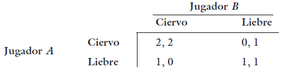

## La Economía de la información

**19. La cosecha de tomates de un agricultor se está secando y tiene que decidir si la riega o no. Si riega los tomates, o si llueve, la cosecha producirá \$1000 de utilidades; pero si los tomates no reciben agua, sólo producirá \$500. La operación del sistema de riego del agricultor cuesta \$100. El agricultor quiere maximizar las utilidades esperadas de la venta de los tomates.**

a.  Si el agricultor considera que hay 50% de probabilidad de que llueva, ¿debe regarlos?

$$
U_{esperada} = P(\text{lluvia}) \cdot U(\text{con lluvia}) + P(\text{sin lluvia}) \cdot U(\text{sin lluvia})
$$ **Estrategia 1: No regar**

$$
U_{no\ regar} = 0.5 \cdot 1000 + 0.5 \cdot 500 = 500 + 250 = 750
$$ **Estrategia 2: Regar**

$$
U_{Regar} = 1000 - 100 = 900
$$

La utilidad esperada de regar es mayor que la de no regar, el agricultor debe de regar los tomates.

b.  ¿Cuál es la cantidad máxima que el agricultor pagaría para obtener información de un meteorólogo itinerante capaz de predecir si lloverá o no con 100% de precisión?

Ahora el valor esperado con información perfecta:

**Si va a llover, entonces no riega y gana:** $$
U_{no\ regar} = 1000
$$

**Si no va a llover, entonces debe regar:**

$$
U_{regar} = 1000 - 100 = 900
$$

Ahora la utilidad total con información perfecta es: $$
U_{esperada\ con\ información} = P(\text{lluvia}) \cdot U_{no\ regar} + P(\text{sin lluvia}) \cdot U_{regar}
$$ $$
U_{esperada\ con\ información} = 0.5 \cdot 1000 + 0.5 \cdot 900 = 500 + 450 = 950
$$

Diferencia entre la utilidad esperada con información perfecta y la utilidad esperada sin información:

$$
Valor_información = U_{esperada\ con\ información} - U_{esperada\ sin\ información}
$$

$$
Valor_{información} = 950 - 900 = 50
$$

La cantidad máxima que el agricultor pagaría para obtener información de un meteorólogo itinerante es \$50.

c.  ¿Cómo cambiaría su respuesta al inciso b si la cantidad de aciertos fuera únicamente del 75 por ciento?

<!-- Si la probabilidad de acierto del meteorólogo es del 75%, entonces debemos ajustar los cálculos de la utilidad esperada con información imperfecta. -->

**Si va a llover:** $$
U_{no\ regar} = 0.75 \cdot 1000 + 0.25 \cdot 500 = 750 + 125 = 875
$$

$$
U_{regar} = 1000 - 100 = 900
$$

Le conviene más regar, ya que la utilidad esperada con información imperfecta es mayor que la de no regar.

**Si no va a llover:**

$$
U_{no\ regar} = 0.75 \cdot 500 + 0.25 \cdot 1000 = 375 + 250 = 625  
$$ $$
U_{regar} = 1000 - 100 = 900
$$

Es mejor regar, ya que la utilidad esperada con información imperfecta es mayor que la de no regar. Por ende, en ambos casos el agricultor debe regar los tomates.

**Valor esperado con información imperfecta:**

Como siempre va a regar los tomates, la utilidad esperada con información imperfecta siempre será 900.

$$
valor_{información} = U_{esperada\ con\ información} - U_{esperada\ sin\ información}
$$

$$
valor_{información} = 900 - 900 = 0
$$

Si la probabilidad de acierto del meteorólogo es del 75%, el agricultor no pagaría nada por la información, ya que no hay un valor esperado adicional al regar los tomates.

**19.3 El problema 18.4 analizaba una póliza de seguros médicos con costos compartidos y demostraba que los individuos con aversión al riesgo preferirían una cobertura total. Sin embargo, supongamos que las personas que compran pólizas con costos compartidos cuidan más su salud, por lo cual la pérdida que sufren cuando están enfermos se reduce de \$10 000 a \$7000. Ahora, ¿Qué determinaría el que un individuo pueda tener estas preferencias? (Basta con que haga un planteamiento gráfico de este problema.)**

¿cuál sería el precio actuarialmente justo de una póliza con costos compartidos? El costo de la póliza con costos compartidos es el precio actuarialmente justo, que se calcula como la probabilidad de enfermedad multiplicada por la pérdida esperada cuando está enfermo.

¿Es posible que algunos individuos prefieran la póliza con costos compartidos a una con cobertura total?

¿Qué determinaría el que un individuo pueda tener estas preferencias?

**Represetanción gráfica de elección:**

```{r, echo = FALSE, fig.cap = "Gráfico de elección entre pólizas de seguros"}
library(ggplot2)
# Datos para el gráfico
precio_justo_costos_compartidos <- 0.5 * 7000 # Precio actuarialmente justo para costos compartidos

datos_grafico <- data.frame(
  Opción = c("Cobertura total", "Costos compartidos"),
  Pérdida = c(10000, 7000),
  Precio = c(10000, precio_justo_costos_compartidos)
)
# Gráfico de barras
ggplot(datos_grafico, aes(x = Opción, y = Pérdida, fill = Opción)) +
  geom_bar(stat = "identity", position = "dodge") +
  geom_text(aes(label = Pérdida), vjust = -0.5) +
  labs(title = "Comparación de pólizas de seguros", y = "Pérdida cuando está enfermo", x = "Tipo de póliza") +
  theme_minimal() +
  scale_fill_manual(values = c("Cobertura total" = "blue", "Costos compartidos" = "orange")) +
  theme(legend.position = "none")
```

**Precio de la póliza con costos compartidos** $$
Precio= Pérdida\ esperada = Probabilidad\ de\ enfermedad\ *  Pérdida\ cuando\ está\ enfermo
$$

**19.5 Supongamos que hay dos tipos de trabajadores, los muy calificados y los de baja calificación. Los salarios de los trabajadores dependen de su capacidad: los muy capacitados ganan \$50,000 por año y los poco capacitados ganan \$30,000. Las empresas no pueden medir las capacidades de los trabajadores, pero pueden observar si un trabajador cuenta con un certificado de que ha terminado sus estudios de secundaria o no. La utilidad de los trabajadores depende de la diferencia entre sus salarios y de los costos que contraen para terminar sus estudios.**

a.  Si el costo de terminar los estudios es el mismo para los dos tipos de trabajadores, ¿puede haber un equilibrio por separado en esta situación, en la cual los trabajadores muy calificados consiguen trabajos bien remunerados y los poco calificados consiguen trabajos mal remunerados?

No, si el costo es igual, los trabajadores poco calificados no tendrían incentivo para terminar sus estudios, ya que el costo de terminar los estudios sería igual al beneficio que obtendrían al conseguir un trabajo bien remunerado. Por lo tanto, no habría un equilibrio separado en el cual los trabajadores muy calificados consigan trabajos bien remunerados y los poco calificados consigan trabajos mal remunerados.

b.  ¿Cuál es la cantidad máxima que pagará un trabajador muy calificado para terminar sus estudios?

La cantidad máxima que un trabajador muy calificado pagaría para terminar sus estudios es la diferencia entre su salario anual y el salario de un trabajador poco calificado, es decir:

$$
\text{Cantidad máxima} = \text{Salario muy calificado} - \text{Salario poco calificado} = 50,000 - 30,000 = 20,000
$$

c.  ¿Por qué terminar los estudios tiene que costar a una persona poco calificada una cantidad superior a esta cantidad si el hecho de terminarlos permite a los empresarios identificar a los trabajadores muy calificados?

La señal sólo funciona si es más barata para los calificados que para los que los no calificados. Esto asegura que solo los calificados terminen sus estudios, lo que permite a los empresarios identificar a los trabajadores muy calificados. Si el costo de terminar los estudios fuera menor o igual para ambos tipos de trabajadores, entonces los trabajadores poco calificados también tendrían un incentivo para terminar sus estudios.

## Teoría de juegos

15.1 Fudenberg y Tirole (1992) desarrollan un juego de caza del ciervo a partir de una observación que, originalmente, hizo Rousseau. Los dos jugadores del juego pueden cooperar para cazar un ciervo o cada uno puede tratar de cazar una liebre por su cuenta. La matriz de pagos de este juego está determinada por

{width="343"}

a.  ¿Cuál es el equilibrio de Nash del juego?

El equilibrio de Nash del juego es el resultado de la estrategia óptima de cada jugador, dado que el otro jugador también está jugando su mejor estrategia. Tanto ciervo-ciervo como liebre-liebre son equilibrios de Nash, ya que si ambos jugadores eligen cazar ciervos, ninguno tiene un incentivo para desviarse a cazar liebres, y lo mismo ocurre si ambos eligen cazar liebres.

b.  Supongamos que B cree que A utilizará una estrategia mixta cuando decide cómo va a cazar. ¿La elección óptima de B cómo dependerá de la probabilidad de que A decida cazar un ciervo?

Si p = probabilidad de que A juega la etapa y B escogera cazar un ciervo si $p> \frac{1}{2}$

c.  Supongamos que este juego se amplía a n jugadores (el juego en el que pensaba Rousseau) y que los n jugadores deben cooperar para poder cazar el ciervo. Suponiendo que los pagos para un jugador dado, por decir, el B, sigan siendo los mismos, y que todos los demás n – 1 jugadores opten por estrategias mixtas, ¿la estrategia óptima de B cómo dependerá de las probabilidades con las que cada uno de los demás jugadores decida cazar a un ciervo? Explique por qué la cooperación parece menos probable en este juego extendido.

Requiere que la probabilidad $p^{(n-1)}>\frac{1}{2}$ para que haya coperación.

15.3 El equilibro de Nash con estrategias mixtas para el juego de la Guerra de los sexos descrito en el ejemplo 15.1 puede depender de los valores numéricos de los pagos. Para generalizar esta solución, supongamos que la matriz de los pagos está determinada por

{width="379"}

donde $K >1$. Demuestre que, en el caso de este juego, este equilibrio de `Nash` con estrategias mixtas depende del valor de $K$.
